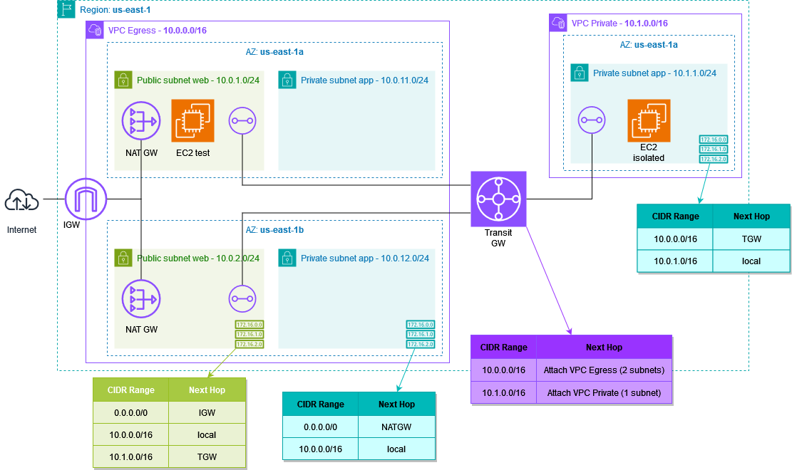

# Ejercicio VPC
## Enunciado

La empresa está investigando cómo proporcionar una arquitectura de red que permita centralizar la conectividad con internet para una aplicación específica que requiere pasar un compliance de seguridad muy estricto.

Por ello, quiere que montemos una VPC con IGW que contenga dos subredes públicas con un NATgw y que se comuniquen con otras VPCs que NO dispondrán de IGW y por lo tanto no podrán hablar directamente con internet, pero que reenviarán las peticiones de salida (por ejemplo, para descargar parches) a la primera. En estas otras VPCs será donde se ejecuten, lógicamente, las cargas de trabajo.

## Esquema de la solución
La propuesta de solución se basa en la implementación un Transit Gateway entre la VPC con acceso a internet (egress VPC) y la VPC sin acceso. En el siguiente esquema también se muestra el contenido de las tablas de enrutamiento:



## Mapas de las VPC's
### VPC Egress


### VPC Private


## Comprobación del tráfico entre VPC's
El código adjunto incluye la creación de una EC2 de prueba ```ec2-test``` y su Security Group ```test_sg``` asociada en la subred pública para conectar mediante SSH (en la consola de adminitración de AWS) a dicha instancia. Desde ella se podrán hacer **pings contra la IP** privada de la instancia EC2 levantada en la VPC sin acceso a internet y **comprobar que existe tráfico**.

